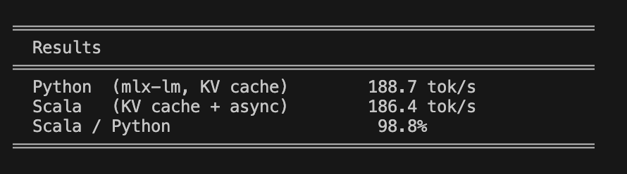

# scala-mlx

LLM inference on Apple Silicon from Scala Native, powered by [mlx-c](https://github.com/ml-explore/mlx-c).

> **Apple Silicon only** — MLX requires Metal GPU on M-series chips (M1/M2/M3/M4). Intel Macs, Linux, and Windows are not supported.

## Overview

scala-mlx runs large language models directly on Apple GPU through Scala Native. The architecture is three layers:

```
Scala Native  (tokenizer, generation loop, sampling)
      │
      │  FFI
      ▼
C/C++ glue   (.csrc/mlx_llm.c + mlx_llm_cpp.cpp)
      │
      │  mlx-c
      ▼
MLX → Metal GPU
```

All tensor operations stay in the C/C++ layer. Scala handles config parsing, BPE tokenisation, the generation loop, and user-facing IO.

## Prerequisites

| Requirement | Install | Notes |
|-------------|---------|-------|
| macOS with Apple Silicon | — | M1, M2, M3, or M4 |
| Xcode Command Line Tools | `xcode-select --install` | Provides `clang`, Metal SDK |
| Homebrew | [brew.sh](https://brew.sh) | Package manager |
| cmake | `brew install cmake` | Builds mlx-c (setup.sh installs if missing) |
| Python 3.8+ | Ships with macOS | Downloads models via `huggingface-cli` |
| scala-cli >= 1.5.0 | `brew install Virtuslab/scala-cli/scala-cli` | Builds Scala Native binaries |

Verify:

```bash
clang --version       # Apple clang 15+
cmake --version       # 3.20+
python3 --version     # 3.8+
scala-cli --version   # 1.5.0+
```

If your scala-cli is older than 1.5.0:

```bash
curl -fL https://github.com/VirtusLab/scala-cli/releases/latest/download/scala-cli-aarch64-apple-darwin.gz \
  | gunzip > /tmp/scala-cli && chmod +x /tmp/scala-cli
```

## Quick start

```bash
# 1. Clone mlx-c (sibling directory)
git clone https://github.com/ml-explore/mlx-c ../mlx-c

# 2. Build mlx-c + C/C++ glue layer, download default model (~335 MB)
./setup.sh

# 3. Run CLI
./test-scala-mlx.sh "Explain the Pythagorean theorem"

# 4. Run interactive chat (see Demo section below)
./demo/run-demo.sh --download Qwen3-0.6B
./demo/run-demo.sh --model Qwen3-0.6B
```

Expected directory layout:

```
your-workspace/
├── mlx-c/         ← github.com/ml-explore/mlx-c
└── scala-mlx/     ← this repo
```

## Demo — interactive chat

The `demo/` directory provides a terminal chat interface built with [layoutz](https://github.com/mattlianje/layoutz).

### Supported models

| Name | Params | Size | Description |
|------|--------|------|-------------|
| Qwen3-0.6B | 0.6B | ~335 MB | Fast, lightweight chat model |
| Qwen3-1.7B | 1.7B | ~1.0 GB | Better quality, still fast |
| Qwen3-4B | 4B | ~2.3 GB | Strong reasoning |
| SmolLM2-135M | 135M | ~270 MB | Tiny, very fast, limited quality |
| Llama-3.2-1B | 1B | ~700 MB | Meta Llama 3.2, general purpose |

### Usage

```bash
# List available models
./demo/run-demo.sh --list-models

# Download a model
./demo/run-demo.sh --download Qwen3-0.6B

# Start chat
./demo/run-demo.sh --model Qwen3-0.6B

# With options
./demo/run-demo.sh --model Qwen3-0.6B --max-tokens 1024 --temperature 0.8
```

### Chat commands

| Command | Action |
|---------|--------|
| `Enter` | Send message |
| `/exit` or `exit` | Quit |
| `/clear` | Clear history |

## Build

`setup.sh` automates the full build:

```bash
./setup.sh
```

This runs three steps:

1. **Build mlx-c** — CMake builds `mlx-c` (from sibling directory `../mlx-c`) into `.build/install/lib/libmlxc.dylib`
2. **Compile C/C++ glue layer** — Compiles `.csrc/mlx_llm.c` and `.csrc/mlx_llm_cpp.cpp` into `.build/libmlxllm.dylib`
3. **Download model** — Downloads `mlx-community/Qwen3-0.6B-4bit` (~335 MB) into `model/`

To rebuild the C/C++ layer manually after changes:

```bash
clang -c -O2 -std=c17 -I.build/install/include -I.csrc .csrc/mlx_llm.c -o .build/mlx_llm.o
clang++ -c -O2 -std=c++17 -I.build/install/include -I.csrc .csrc/mlx_llm_cpp.cpp -o .build/mlx_llm_cpp.o
clang++ -dynamiclib -o .build/libmlxllm.dylib .build/mlx_llm.o .build/mlx_llm_cpp.o \
  -L.build/install/lib -lmlxc -lmlx -lc++ -Wl,-rpath,@loader_path
```

## Testing

```bash
# Unit tests (no model or dylibs required)
./run-tests.sh

# Integration tests (requires ./setup.sh first)
./run-tests.sh --integration

# All tests
./run-tests.sh --all
```

**Unit tests** cover:
- `LlamaConfigSpec` — JSON config parsing, field defaults, derived values
- `TokenizerSpec` — BPE merges, special token handling, encode/decode round-trips
- `SamplingSpec` — argmax, softmax, temperature scaling, top-p nucleus filtering

**Integration tests** (require model weights + compiled dylibs):
- Model loading and config validation
- Greedy generation determinism
- EOS stopping behaviour
- UTF-8 decode correctness
- Token callback contract

## Architecture

### C/C++ layer (`.csrc/`)

Implements the LLaMA/Qwen3 transformer forward pass:

| Stage | Operations |
|-------|------------|
| Embed | Quantized embedding lookup via `mlx_take_axis` + `mlx_dequantize` |
| Attention | RMS norm, Q/K/V projection, QK-norm (optional), RoPE, SDPA |
| FFN | SwiGLU with compiled activation |
| Output | RMS norm, LM head projection |

Two decode paths:
- **Pipeline** — C++ native decode loop, GPU-side sampling, double-buffered async eval
- **CPU sampling** — Step-by-step decode with nucleus (top-p) filtering on CPU

### Scala layer (`src/`)

| File | Role |
|------|------|
| `MlxLlm.scala` | FFI bindings (`@extern`) |
| `LlamaConfig.scala` | Parses `config.json` |
| `Tokenizer.scala` | ByteLevel BPE with regex pre-tokenization |
| `Sampling.scala` | Softmax, temperature, top-p |
| `Sampler.scala` | Zero-allocation sampler |
| `LlamaModel.scala` | Prefill + autoregressive decode with KV cache |
| `Main.scala` | CLI entry point |

### Model compatibility

The C layer auto-detects:
- **QK-norm**: applied if `q_norm`/`k_norm` weights exist (Qwen3), skipped otherwise (LLaMA)
- **LM head mode**: separate float, separate quantized, weight-tied float, or weight-tied quantized

## Performance — Python mlx-lm vs scala-mlx

Benchmarked on Qwen3-0.6B-4bit with greedy decoding (temperature=0, 200 tokens):

| Implementation | tok/s |
|----------------|-------|
| Python mlx-lm (KV cache) | 188.7 |
| scala-mlx (KV cache + async) | 186.4 |
| **scala-mlx / Python** | **98.8%** |



scala-mlx achieves near-parity with Python's mlx-lm library through:
- **KV cache** — O(1) per decode step instead of O(n) recomputation
- **C++ native decode loop** — GPU-side sampling eliminates 512KB logits transfer per token
- **Double-buffered async eval** — GPU never idles between decode steps
- **SwiGLU compile** — fused activation reduces kernel launch overhead

### Limitations

- **Single safetensors shard** — multi-shard models not supported
- **4-bit quantization only** — `group_size=64, bits=4` (GPTQ, AWQ, fp8 etc. not supported)
- **Apple Silicon only** — requires Metal GPU on M-series chips

## License

MIT
